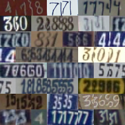
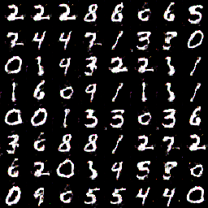

# UCDIG_tensorflow

Tensorflow implementation of `Unsupervised Cross-Domain Image Generation` (https://arxiv.org/abs/1611.02200)
Since I can't find the emoji dataset so I decided to test the algorithm using SVHN and mnist dataset. However the results still not good, for examples:

You can notice the style is changed but the number is not matched.

Setup
=====
Prerequisites
-----
> 1. Linux of OSX
> 2. python3
> 3. tensorflow

Getting Started
-----
> 1. clone the repo
> 2. start virtualenv
> 3. install tensorflow(https://www.tensorflow.org/versions/r0.11/get_started/os_setup.html) and other requirements(pip install -r requirements.txt)
> 4. prepare the data. Download SVHN dataset `extra_32x32.mat` from http://ufldl.stanford.edu/housenumbers/ and MNIST train dataset from http://pjreddie.com/projects/mnist-in-csv/
> 5. create a folder called data and move two downloaded file to the data folder.

Train
-----
> 1. execute `python UCDIG_tensorflow train`

Acknowledgments
-----
Code borrows heavily from [DCGAN](https://github.com/soumith/dcgan.torch).
